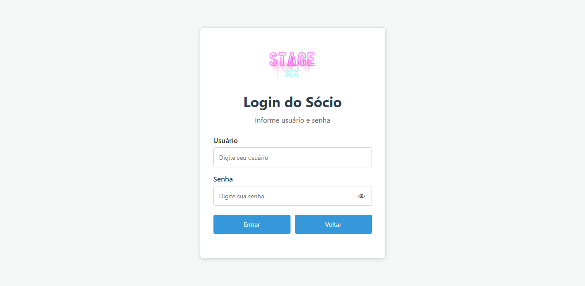
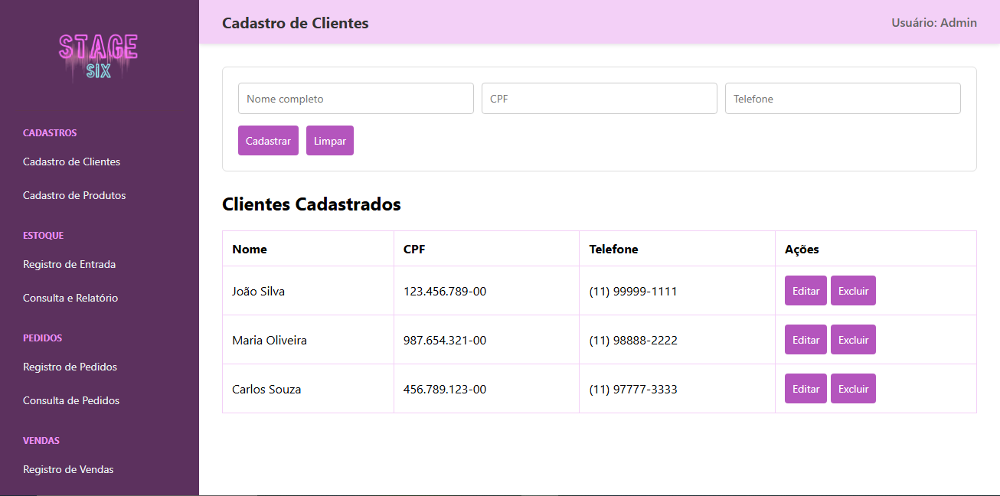
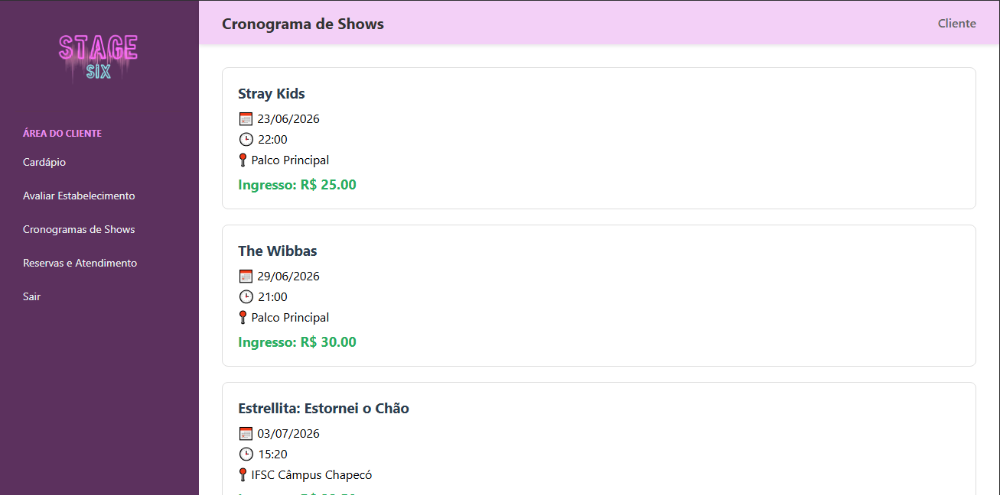
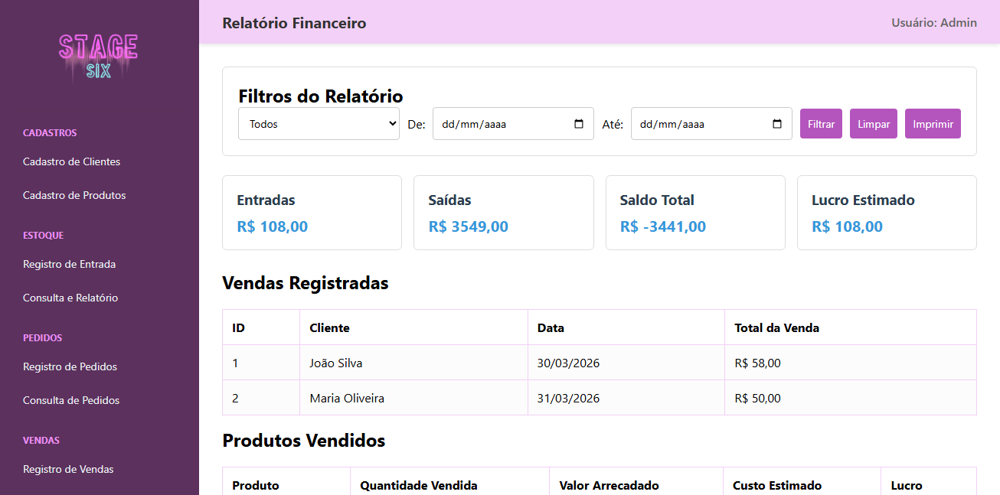

# 📁 Sistema CRUD de um estabelecimento de Bar e Karaoke

> Um sistema de estabelecimento de Bar e Karaoke no formato CRUD desenvolvido pela solicitação de um trabalho escolar.

## 🚀 Sobre o Projeto

Este projeto consiste em um sistema de gerenciamento para um estabelecimento de Bar e Karaoke, desenvolvido como trabalho da disciplina de Desenvolvimento Web.

O sistema foi implementado utilizando HTML, CSS e JavaScript, simulando um ambiente administrativo e uma área destinada aos clientes. As informações são armazenadas localmente no navegador por meio do LocalStorage, permitindo a simulação das operações de um sistema CRUD completo.

## 🛠️ Tecnologias e Recursos Utilizados

O desenvolvimento do ecossistema foca na manipulação dinâmica do Front-End integrado a um back-end simulado:

* **HTML5:** Estruturação semântica das páginas da aplicação.
* **CSS3:** Estilização da interface, proporcionando um design organizado, responsivo e de fácil utilização.
* **JavaScript (ES6):** Implementação da lógica do sistema, manipulação dinâmica do DOM, validação de formulários e gerenciamento das funcionalidades da aplicação.
* **LocalStorage:** Armazenamento local dos dados cadastrados, permitindo a persistência das informações durante a utilização do sistema.

## ⚙️ Funcionalidades (CRUD)

### Área Administrativa

- Cadastro de clientes
- Cadastro de produtos
- Registro de entrada no estoque
- Consulta do estoque
- Registro de pedidos
- Consulta de pedidos
- Registro de vendas
- Relatório financeiro
- Relatório de avaliações
- Relatório de reservas

### Área do Cliente

- Visualização do cardápio
- Avaliação do estabelecimento
- Consulta ao cronograma de shows
- Solicitação de reservas
- Pagamento fictício das reservas
- Cancelamento de reservas

### Recursos Gerais

- Controle de estoque
- Atualização automática do fluxo de caixa
- Impressão de relatórios
- Login de sócios (simulado)
- Área exclusiva para clientes

---

## 📦 Como Executar

1. Clone o repositório (https://github.com/os-guri-da-programa/ProjetoEngenharia).

2. Abra o projeto no Visual Studio Code.

3. Utilize a extensão Live Server para executar o projeto ou abra o arquivo index.html diretamente no navegador.

## 📷 Telas do Sistema

### Login

### Menu Administrativo

### Área do Cliente

### Relatórios

---

## 📂 Estrutura do Projeto

/pasta_fabiane → Página inicial dos administradores e dos clientes, CSS geral.

/pasta_mateus → Cadastro de clientes e produtos, cronograma de shows.

/pasta_davi → Registro de entradas, relatório de vendas, avaliações dos clientes.

/pasta_pedro → Registro de pedidos, reserva de mesas.

/pasta_heitor → Consulta de pedidos, relatório de avaliações e e reservas.

/pasta_enzo → Registro de vendas, relatório financeiro e cardápio.

/images → Imagens do sistema.

## ✔ Requisitos Atendidos

### Requisitos Funcionais:

- RF.001 O sistema deve permitir o cadastro dos clientes.
- RF.002 O sistema deve permitir cadastro de produtos.
- RF.003 O sistema deve permitir o registro de estoque.
- RF.004 O sistema deve permitir o cadastro de comandas virtuais gerenciadas pelo garçom e caixa.
- RF.005 O sistema deve emitir um relatório de estoque.
- RF.006 O sistema deve emitir um relatório de vendas semanais.
- RF.007 O sistema deve emitir um relatório de vendas mensais.
- RF.008 O sistema deve fornecer informações atualizadas sobre o fluxo de caixa.
- RF.009 O sistema deve permitir que os cozinheiros acessem as comandas virtuais.
- RN.009 Cozinheiros devem visualizar apenas comandas em aberto e itens pendentes de preparo.
- RF.010 O sistema deve permitir que os usuários avaliem o estabelecimento.
- RF.011 O sistema deve fornecer aos clientes um cronograma de shows.
- RF.012 O sistema deve disponibilizar um número de telefone para atendimento remoto.
- RF.013 O sistema deve permitir que administradores acessem informações classificadas como restritas.

### Requisitos Não Funcionais:

- RNF.001 O sistema deve funcionar em dispositivos móveis com sistema operacional Android das versões 10 a 16;
- RNF.002 O sistema deve funcionar em dispositivos móveis com sistema operacional iOS das versões 12 a 18;
- RNF.003 O sistema deve funcionar nos navegadores Firefox, Chrome e Microsoft Edge;
- RNF.005 O sistema deve implementar controle de acesso baseado em papéis (RBAC).

## 📄 Licença

Projeto desenvolvido exclusivamente para fins acadêmicos.

## 👥 Equipe

**Instituição**
Instituto Federal de Santa Catarina (IFSC) – Câmpus Chapecó

**Docentes**
- Prof.ª Lara Popov Zambiasi Bazzi Oberderfer
- Prof. Marcos Virgilio

**Desenvolvedores**
- Davi Emilio da Massena Stobe
- Enzo Brancher Maragno
- Fabiane Moraes de Oliveira
- Heitor Gromovski
- Mateus Furlan Krutschener
- Pedro Henrique Franz Mignoni

**Ano**
2026
